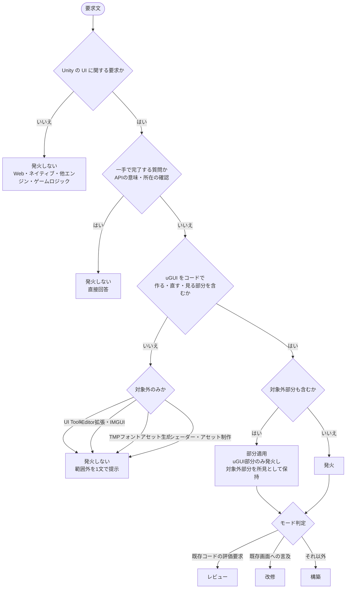
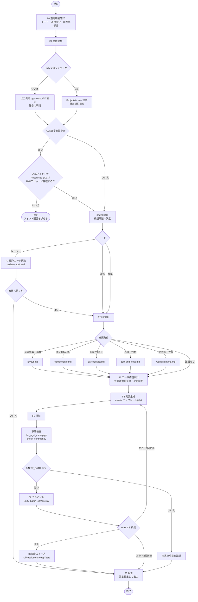
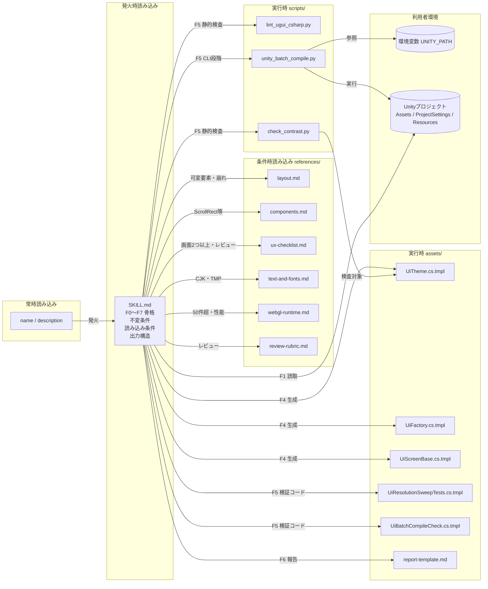

# Unity uGUI ランタイムUI/UX実装スキル — 製品版フルエディション 設計書

- リポジトリ名：`unity-ugui-runtime-ui-skill`
- スキル名（`name`）：`unity-ugui-runtime-ui`
- 対象エディション：製品版フルエディション（納品用）
- プラットフォーム：エージェントスキル（Agent Skills / `SKILL.md`）
- 配信方式：配布型（Gitリポジトリ。パッケージは`.skill`形式）

---

## 1. 概要

### 1.1 課題

Unity（WebGL）のゲーム・アプリで、uGUI（Unity UI）の画面をEditorのGUI操作を一切使わずC#コードのみで動的生成する開発方針を採る場合、UI/UXの設計判断（情報階層、レイアウト方式、状態表現、フィードバック、操作性、解像度追従、アクセシビリティ）と、uGUIをコードで組み立てる際の落とし穴（EventSystemの欠落、CanvasScalerの未設定、LayoutGroupとContentSizeFitterの干渉、ScrollRectの構成不備、フォント未同梱による文字化け、Editor専用APIの混入）を、エージェントに毎回同じ内容で指示し直す必要がある。Web/HTML向けのUIデザインスキルは存在するが、uGUIのC#実装には転用できない。

### 1.2 製品版フルエディションの到達点

Claude Code・Codex・Antigravityの3ツールで同一の`SKILL.md`が発火し、同一構造の成果物（画面ビルダーのC#、テーマ定義、検証コード、実装報告）を生成する。`scripts`・`references`・`assets`の全構成を備え、対象ツール・Agent Skills標準・Unityの仕様変更に追随する改訂フローと、誤発火・未発火・ホスト間差を定期確認する体制を持つ。

### 1.3 ターゲットとプラットフォームの選定理由

- 成果物（手順定義）を直接読んで実行するのはAIエージェントである。人間はエージェントに指示する起点にすぎず、判別材料にならない。したがってAI向けプラットフォームから選定する。
- 課題の性質は「毎回同じ手順・判断基準を指示し直している」であり、エージェントに新しい能力を与える必要はない。uGUIのC#生成・ファイル編集・Unity CLIの実行は、エージェントが既に持つ能力（ファイル操作・シェル実行）の組み合わせで実現できる。よって**エージェントスキルを選択する。**
- 状態の永続化・マルチユーザー対応を要しないため、MCPサーバーを選択する理由がない。専用UIを持たないため、ウェブ・デスクトップも選択しない。
- 手順の受け手がAIエージェントであるため、電子書籍は選択しない。

### 1.4 製品版フルエディションの適用制約

| 項目 | 適用内容 |
|---|---|
| 内容 | 全構成（`SKILL.md`・`scripts`・`references`・`assets`）。3ツール対応 |
| デザイン | あり（出力フォーマットの定義・テンプレートの作り込み） |
| 測定 | あり（テストプロンプトによる発火・タスク成功の記録。目標値は設けない） |
| 保守 | あり（対象ツール・標準・Unityの仕様変更への追随、`description`の改善、再配布） |
| 監視 | あり（誤発火・未発火の検知、ホスト間の挙動差の確認） |
| サーバ・DB・認証・セッション | 存在しないため非適用 |
| 外部API | 利用者の環境・資格情報で動作するため制限なし。ただし資格情報は環境変数名のみ記載する |
| 個人情報 | 非適用。ただし成果物内に実在の個人を特定できる情報を記載しない |
| ハードウェア連携 | 対象外 |

### 1.5 対象バージョンと参照日

この領域は仕様変更が速いため、以下を対象として固定し、改訂時に再確認する（参照日：2026年9月2日）。

| 対象 | バージョン | 一次情報 |
|---|---|---|
| Agent Skills 標準 | agentskills.io Specification（参照日時点の公開版） | https://agentskills.io/specification |
| Claude Code | 2.1.258（2026-09-01） | https://code.claude.com/docs/en/changelog ／ https://code.claude.com/docs/en/skills |
| Codex CLI | 0.152.1（2026-09-01） | https://developers.openai.com/codex/skills |
| Antigravity | 2.0（2026-05-19 発表） | https://antigravity.google/blog/google-io-2026 |
| Unity | 6.3 LTS（uGUI 2.0 はEditorと同一バージョンに固定されたコアパッケージ）。6.6（2026-09-01）を Supported Update として併記 | https://unity.com/releases/unity-6/support ／ https://docs.unity3d.com/6000.3/Documentation/Manual/com.unity.ugui.html |

標準で共通なのは`name`・`description`・本文のコアのみである。ホスト固有フィールド（Claude Codeの`allowed-tools`・`disable-model-invocation`・`context`、Codexの`agents/openai.yaml`）は使用しない。

---

## 2. スキルの定義

### 2.1 目的

Unity（WebGL）のuGUIによるユーザーインターフェースを、Editor GUI操作なし・C#コードのみで新規構築・改修・レビューする際に、UX設計判断とuGUI実装の手順・判断基準をエージェントに与える。

### 2.2 対象範囲

| 区分 | 内容 |
|---|---|
| 対象 | Canvas / CanvasScaler / RectTransform（アンカー・ピボット）/ LayoutGroup系 / ContentSizeFitter / LayoutElement / Image / RawImage / Text（`UnityEngine.UI.Text`）/ Button / Toggle / Slider / Scrollbar / ScrollRect / Dropdown / InputField / Mask / RectMask2D / EventSystem / Selectable のナビゲーション / Graphic Raycaster |
| 対象 | UX設計：情報階層、画面構成、レイアウト方式の選択、状態（初期・読込中・空・エラー・無効）、フィードバック（押下遷移・トースト・確認）、操作導線（戻る・フォーカス順・キーボード操作）、解像度・アスペクト比追従、アクセシビリティ基礎（タップ領域・コントラスト・色以外の区別・最小文字サイズ） |
| 対象 | 検証：Unity CLI（batchmode）によるコンパイル確認、Play Modeテストによる解像度スイープ、生成コードの静的検査 |
| 対象外 | UI Toolkit（UXML・USS・VisualElement）、Editor拡張（EditorWindow・IMGUI `OnGUI`・Inspector拡張）、TextMeshProのフォントアセット生成、シェーダー・VFX、Unity以外のUI（Web・ネイティブ・他エンジン）、ゲームロジック単体 |

### 2.3 対象ホストと設置先

| ホスト | ワークスペース設置先 | グローバル設置先 | 明示呼び出し |
|---|---|---|---|
| Claude Code | `.claude/skills/<name>/` | `~/.claude/skills/<name>/` | `/unity-ugui-runtime-ui` |
| Codex CLI | `.agents/skills/<name>/` | `~/.agents/skills/<name>/` | `$unity-ugui-runtime-ui` |
| Antigravity | `.agents/skills/<name>/`（`.agent/skills/`も後方互換） | `~/.gemini/antigravity/skills/<name>/` | 会話中でスキル名に言及 |

設置先パスは参照日時点の一次情報・コミュニティ検証に基づく。改訂フロー（13章）で定期的に再確認する。

---

## 3. 発火条件の設計方針

発火はもっぱら`description`で決まるため、発火条件は本文ではなく`description`に集約する。本文側には「発火後に適用範囲外と判明した場合の離脱手順」のみを置く。

### 3.1 `description`に含める要素

| 要素 | 方針 |
|---|---|
| 何をするか | uGUIのUIをC#コードのみで構築・改修・レビューすること、UX設計判断を含むことを冒頭で述べる |
| どの文脈で使うか | Unity・uGUI・Canvas・RectTransform・ScrollRect・Button・レイアウト・レスポンシブ・使いやすさ・WebGL のいずれかが現れ、かつ複数手順を要する要求 |
| 使わない文脈 | UI Toolkit（UXML/USS）、EditorWindow・IMGUI、TextMeshProのフォントアセット生成、Unity以外のUI、を明示的に除外する |
| 語の配置 | 主要ユースケースを先頭に置く。ホストが一覧の文字数予算に合わせて末尾から切り詰めても発火語が残る構成とする |
| 長さ | 400文字以内（標準上限1024文字。Claude Codeは一覧予算超過時に切り詰め、Codexは一覧全体を約2%のコンテキスト予算で保持するため） |

### 3.2 発火すべき要求の類型

- 画面・パネル・HUD・メニューをuGUIでコードから新規に作る
- 既存のuGUI画面の操作性・見た目・レイアウト崩れ・押しづらさを改善する
- 既存のUIビルダーC#をUX観点でレビューする
- ScrollRectによる一覧、状態表示（読込中・空・エラー）、確認ダイアログなど複数コンポーネントの組み合わせを実装する
- 解像度・アスペクト比の変化に追従させる

### 3.3 発火すべきでない要求の類型

- UI ToolkitでのUI構築（UXML・USS）
- Editor拡張・Inspector拡張・IMGUI
- TextMeshProフォントアセットの生成・SDF設定
- Web・ネイティブ・他エンジンのUI
- ゲームロジック・シェーダー・アセット制作
- 一手で完了する質問（APIの意味・ドキュメントの所在）

### 3.4 部分適用

要求がuGUIと対象外（UI Toolkit等）の双方を含む場合、スキルはuGUI部分にのみ適用され、対象外部分は「本スキルの範囲外」として明示したうえで通常処理に委ねる。全体を拒否せず、全体を引き受けもしない。

---

## 4. 入出力フォーマット

### 4.1 入力

| 項目 | 内容 | 欠落時の扱い |
|---|---|---|
| 要求文 | 作る・直す・見る対象の画面と目的 | 必須 |
| Unityプロジェクト | `Assets/`と`ProjectSettings/`を持つディレクトリ | 5.2節の判定に従う（存在しなければ出力先を固定して報告） |
| Unityバージョン | `ProjectSettings/ProjectVersion.txt` | 読み取る。6000.0未満は互換注意として報告 |
| 既存UI規約 | テーマ定義・ファクトリ・命名・フォルダ | 5.2節で探索。存在すれば従う |
| 文字体系 | UIに表示する文字列の言語 | 要求文・既存文言から判定。CJKを含みフォントが無ければ停止 |
| 参照解像度 | CanvasScalerの基準 | 既定 1920×1080 |
| 入力方式 | マウス／タッチ／キーボード・ゲームパッド | 既定 マウス＋タッチ。キーボード操作は要求時のみ |
| Unity実行パス | 環境変数 `UNITY_PATH` | 未設定なら検証段階（5.6節）を下位段階に切り替える |

### 4.2 出力

| 成果物 | 形式 | 備考 |
|---|---|---|
| 画面ビルダー | `Assets/Scripts/UI/Screens/<ScreenName>Screen.cs`（既存規約があればそれに従う） | 画面1つにつき1クラス。生成（Build）と状態反映（Render）を分離 |
| 共通基盤 | `Assets/Scripts/UI/UiTheme.cs`・`UiFactory.cs`・`UiScreenBase.cs` | 既存に同等物があれば新規作成しない |
| 検証コード | `Assets/Tests/PlayMode/UiResolutionSweepTests.cs`・`Assets/Editor/UiBatchCompileCheck.cs` | 後者はGUIを持たないEditorスクリプト（CLI実行用） |
| 実装報告 | 会話上のMarkdown（`assets/report-template.md`の構造） | 決定事項・前提・UXチェック結果・未検証項目・範囲外の指摘 |

実装報告の構造は固定であり、ホストによらず同一の見出しで出力される：対象と模式図、前提と既定値、UX判断、生成・変更ファイル、検証段階と結果、既知の制限、範囲外の所見。

---

## 5. 手順の論理構造

各関数は三人称で「何を受け取り、何を判定し、何を返すか」を定義する。

### 5.1 F0：適用範囲確認（confirmScope）

**入力**：要求文。

**出力**：モード（構築／改修／レビュー）、適用部分、範囲外部分。

**手順**

1. 要求文を「uGUIでコードから作る・直す・見る」に該当する部分と、2.2節の対象外に該当する部分に分ける。
2. 適用部分が空であれば、スキルの適用を取り下げ、範囲外である旨と代替（UI Toolkit・Editor拡張・TMPフォント生成は本スキルの範囲外）を1文で示して終了する。
3. 適用部分について、既存画面への言及があれば改修、コード評価の要求であればレビュー、それ以外を構築とする。複数に該当する場合はレビュー→改修→構築の順に優先する（既存物の把握を先行させる）。
4. 範囲外部分があれば、報告の「範囲外の所見」に記載する対象として保持する。

### 5.2 F1：前提収集（collectPremises）

**入力**：作業ディレクトリ、要求文。

**出力**：前提セット（プロジェクト有無、Unityバージョン、既存規約、文字体系、テキスト方式、参照解像度、入力方式、検証段階）と、前提ごとの出所（読取／既定／利用者指定）。

**手順**

1. **プロジェクト判定**：`Assets/`と`ProjectSettings/`の双方が存在すればUnityプロジェクトとする。いずれかが無ければ「プロジェクト不在」とし、出力先を作業ディレクトリ直下の`ugui-output/`に固定して報告に明記する。ファイルの散在を防ぐため、推測したパスへは書かない。
2. **バージョン**：`ProjectSettings/ProjectVersion.txt`を読む。6000.0未満は`LegacyRuntime.ttf`の名称差など互換注意点を報告に付す。
3. **既存規約探索**：`Assets/`配下のC#から、`UnityEngine.UI`を参照するクラス、`Theme`・`Palette`・`UiFactory`・`Screen`等の命名、`TMPro`名前空間の使用、`Resources/`配下のフォントファイル（`.ttf`・`.otf`）とTMPフォントアセットを列挙する。見つかった規約（配置・命名・テーマ）は新規作成より優先する。
4. **テキスト方式**：既存コードが`TMPro`を使用し、かつ表示対象の文字体系をカバーするTMPフォントアセットが既に存在する場合のみTextMeshProを用いる。それ以外は`UnityEngine.UI.Text`を用いる。フォントアセットの生成は行わない（範囲外）。
5. **文字体系ゲート**：要求文・既存文言・仕様にCJK（日本語を含む）文字が含まれる場合、`Resources/`配下にその文字体系を含むフォントファイル、または対応するTMPフォントアセットが存在するかを確認する。存在しなければ**停止**し、フォントファイルの配置（ライセンス確認済みのものを`Assets/Resources/Fonts/`へ）を求める。組み込みの`LegacyRuntime.ttf`はCJKを含まず、WebGLではOSフォントへのフォールバックが無いため、代替せずに停止する。
6. **既定値の適用**：参照解像度・入力方式・マッチ方式は4.1節の既定値を適用し、出所を「既定」として報告に列挙する。既定が安全である項目は質問せず先へ進む。
7. **検証段階の決定**：`UNITY_PATH`が設定され実行可能ならCLI段階、そうでなければ静的検査段階とする（5.6節）。
8. 前提セットを返す。停止条件（手順5）に該当した場合は、以降の関数を実行しない。

### 5.3 F2：UX設計（designUx）

**入力**：モード、要求文、前提セット。

**出力**：UX設計メモ（画面インベントリ、情報階層、レイアウト方式、状態一覧、フィードバック、導線、追従規則、アクセシビリティ判定）。

**手順**

1. **画面インベントリ**：要求から画面・パネル・部品を列挙し、それぞれの目的（1文）と主要操作（最大3つ）を定める。
2. **情報階層**：各画面で最も重要な情報・操作を1つ選び、視線の起点（左上または中央）に置く。主要操作は1画面に1つ、二次操作は視覚的に弱める。
3. **レイアウト方式の選択**：要素数が固定かつ少数ならアンカー固定、可変・並列ならLayoutGroup、一覧ならScrollRect、と決める。同一階層でアンカー固定とLayoutGroupを混在させない。
4. **状態一覧**：初期・読込中・空・エラー・無効・成功の各状態について、表示の有無と文言を定める。データを扱う画面では空とエラーを省略しない。
5. **フィードバック**：押下可能な要素は押下遷移（色または拡縮）を持つ。破壊的操作は確認を挟む。結果通知はトーストまたはインライン表示とし、モーダルを乱用しない。
6. **導線**：戻る手段を必ず置く。モーダルは背景タップまたは閉じるボタンで閉じられる。キーボード操作が要求される場合はSelectableのナビゲーションを明示設定し、自動ナビゲーションに頼らない。
7. **追従規則**：CanvasScalerは`ScaleWithScreenSize`、参照解像度は前提セットの値、マッチは横長で0.5・縦長で0（幅基準）とする。端に寄せる要素はアンカーで、中央の内容は最大幅を持つコンテナで制御する。
8. **アクセシビリティ判定**：タップ領域は参照解像度で44px四方以上、本文の最小文字サイズは参照解像度で14px以上、前景・背景のコントラスト比は4.5以上、状態の区別は色のみに依らずアイコン・文言を併用する。テーマの色はこの判定を満たす組み合わせのみ採用する。
9. 設計メモを返す。レビュー・改修モードでは既存実装をこのメモと突き合わせ、差分を「所見」として列挙する。

### 5.4 F3：コード構造設計（designStructure）

**入力**：UX設計メモ、前提セット。

**出力**：クラス構成（画面ビルダー・共通基盤・検証コード）、ファイル配置、依存関係、変更範囲（改修モード）。

**手順**

1. 共通基盤の有無を前提セットから判定し、無ければ`UiTheme`（色・寸法・余白・文字サイズ）、`UiFactory`（Canvas・Panel・Text・Button・Toggle・Slider・ScrollRect・InputField・Dropdownの生成関数）、`UiScreenBase`（Build／Render／Show／Hideの骨格）を`assets/`のテンプレートから起こす。
2. 画面ごとに`<ScreenName>Screen`を定め、`Build`（階層生成。1回のみ）と`Render(state)`（状態反映。何度でも）を分ける。生成後に名前検索（`GameObject.Find`・`transform.Find`）で要素を取り直さず、生成時の参照をフィールドに保持する。
3. ルートは`Canvas`＋`CanvasScaler`＋`GraphicRaycaster`を1組とし、`EventSystem`と入力モジュールはシーンに1つだけ存在するよう、無ければ生成する。
4. ScrollRectは Viewport（`RectMask2D`）→ Content（`VerticalLayoutGroup`＋`ContentSizeFitter`）の構成に固定する。件数が不明または50件を超える一覧は行の使い回し（プール）を設計に含める。
5. LayoutGroupの子に`ContentSizeFitter`を置かない。子の寸法は`LayoutElement`で与える。`ContentSizeFitter`はLayoutGroupを持つオブジェクト自身にのみ付与する。
6. 角丸・枠線が必要な場合は、実行時に生成した9分割スプライト（手続き的テクスチャ）を`UiFactory`が供給する。Editor専用の組み込みスプライトは参照しない。
7. `UnityEditor`名前空間・`OnGUI`・`AssetDatabase`を実行時コードに含めない。Editorスクリプトは`Assets/Editor/`配下のCLI実行用に限る。
8. **改修モード**：変更範囲を要求に関係するファイル・メソッドに限定する。要求外で不変条件（6章）に反する箇所は変更せず、所見として報告する。
9. 構成を返す。

### 5.5 F4：実装生成（generateCode）

**入力**：クラス構成、UX設計メモ、前提セット。

**出力**：C#ファイル群、変更差分（改修モード）。

**手順**

1. `assets/`のテンプレートを起点に、テーマ→ファクトリ→基底→画面の順に生成する。既存規約がある場合はテンプレートの命名・配置を既存に合わせて置き換える。
2. 文言はすべて`UiTheme`または画面クラスの定数に集約し、リテラルを散在させない。
3. 色・寸法・文字サイズは`UiTheme`の値のみを用いる。
4. 状態一覧のすべてを`Render(state)`が扱い、未定義状態は例外ではなく「空」表示に倒す。
5. ボタンは`onClick`の登録を`Build`で1回だけ行い、`Render`で再登録しない。
6. 生成後、`scripts/lint_ugui_csharp.py`の検査対象となる禁止パターン（7.3節）を自己確認する。
7. ファイル群を返す。

### 5.6 F5：検証（verify）

**入力**：C#ファイル群、前提セット（検証段階）。

**出力**：検証結果（段階、合否、所見）。

**手順**

1. **静的検査**（全段階共通）：`scripts/lint_ugui_csharp.py`で禁止パターン・必須構成（EventSystem生成、CanvasScaler設定、ScrollRect構成、`ContentSizeFitter`の配置）を検査する。`scripts/check_contrast.py`でテーマの前景・背景の組み合わせを検査する。
2. **CLI段階**（`UNITY_PATH`あり）：`scripts/unity_batch_compile.py`が`-batchmode -nographics -quit -executeMethod`でコンパイルと`UiBatchCompileCheck`を実行し、ログの`error CS`を検出する。失敗時は原因箇所を修正し、同一手順を再実行する（上限3回）。
3. **解像度スイープ**（CLI段階のみ）：Play Modeテスト`UiResolutionSweepTests`が16:9・4:3・21:9・9:16の各比率で画面を構築し、要素の画面外はみ出し、`Text`の`preferredWidth`超過、タップ領域の下限割れを検出する。
4. **未検証の明示**：静的検査段階に留まった場合、報告の「検証段階と結果」に「CLIコンパイル未実施」「解像度スイープ未実施」を明記する。実施していない検証を実施済みとして報告しない。
5. 検証結果を返す。

### 5.7 F6：報告（report）

**入力**：モード、前提セット、UX設計メモ、ファイル群、検証結果、範囲外部分。

**出力**：実装報告（4.2節の固定構造）。

**手順**

1. 対象画面の模式図（テキストによる配置図）を先頭に置く。
2. 前提と既定値を、出所（読取／既定／利用者指定）付きで列挙する。
3. UX判断（レイアウト方式・状態・フィードバック・導線・追従・アクセシビリティ）を1項目1行で記す。
4. 生成・変更ファイルを一覧にし、改修モードでは変更範囲外の所見を分けて記す。
5. 検証段階と結果、既知の制限（CLI未実施・フォント未同梱等）、範囲外の所見（UI Toolkit等）を記す。
6. 報告を返す。

### 5.8 F7：レビューモード固有手順（reviewExisting）

**入力**：既存のUI関連C#、UX設計メモ。

**出力**：所見一覧（重大度、根拠、修正方針）。

**手順**

1. `references/review-rubric.md`の観点（不変条件・UX項目・保守性）ごとに既存コードを照合する。
2. 所見は「重大（動作しない・操作できない）」「改善（使いにくい・崩れる）」「提案（保守性）」の3段階に分ける。
3. 修正方針は1所見1方針とし、コードの全面書き換えを提案しない。
4. 所見一覧を返す。改修モードへ続く場合、重大所見のうち要求範囲内のもののみをF3以降で扱う。

---

## 6. 設計原則（不変条件）

`references`を読まずに`SKILL.md`のみで実行された場合でも誤った成果物が生成されないよう、以下は`SKILL.md`本文に常設し、`references`へは移さない。

1. Editor GUI操作を前提にしない。実行時コードに`UnityEditor`名前空間・`OnGUI`・`AssetDatabase`を含めない。
2. シーンに`EventSystem`と入力モジュールを1つ用意する。無ければ生成する。
3. 各Canvasに`CanvasScaler`（`ScaleWithScreenSize`）と`GraphicRaycaster`を付与する。
4. LayoutGroupの子に`ContentSizeFitter`を付与しない。子の寸法は`LayoutElement`で与える。
5. ScrollRectはViewport（`RectMask2D`）とContent（LayoutGroup＋`ContentSizeFitter`）の構成で組む。
6. 生成した要素の参照はフィールドで保持し、名前検索で取り直さない。
7. CJK文字を表示する場合、対応フォントが`Resources/`またはTMPフォントアセットとして存在しなければ停止する。組み込みフォントで代替しない。
8. TextMeshProのフォントアセットを生成しない。既存アセットがある場合に限りTMPを用いる。
9. 色・寸法・文字サイズ・文言はテーマまたは定数に集約する。
10. 押下可能要素はタップ領域44px以上（参照解像度基準）、コントラスト比4.5以上、状態は色以外でも区別する。
11. 改修モードでは要求範囲外を変更せず所見として報告する。
12. 実施していない検証を実施済みとして報告しない。

---

## 7. リソース構成と分割方針

### 7.1 構成

```
unity-ugui-runtime-ui-skill/
├── skills/
│   └── unity-ugui-runtime-ui/          # 配布単位（Single Source of Truth）
│       ├── SKILL.md
│       ├── references/
│       │   ├── layout.md               # アンカー・LayoutGroup・ContentSizeFitter・追従規則
│       │   ├── components.md           # 各コンポーネントのコード構築手順と落とし穴
│       │   ├── ux-checklist.md         # 情報階層・状態・フィードバック・導線・アクセシビリティ
│       │   ├── text-and-fonts.md       # Text/TMPの選択、フォント同梱、CJK、WebGLの制約
│       │   ├── webgl-runtime.md        # 解像度・入力・性能（Canvas再構築・バッチ）・ブラウザ差
│       │   └── review-rubric.md        # レビュー観点と重大度の判定基準
│       ├── scripts/
│       │   ├── lint_ugui_csharp.py     # 禁止パターン・必須構成の静的検査
│       │   ├── check_contrast.py       # テーマ色のコントラスト比検査
│       │   └── unity_batch_compile.py  # UNITY_PATH を用いたCLIコンパイル・テスト実行
│       └── assets/
│           ├── UiTheme.cs.tmpl
│           ├── UiFactory.cs.tmpl
│           ├── UiScreenBase.cs.tmpl
│           ├── UiResolutionSweepTests.cs.tmpl
│           ├── UiBatchCompileCheck.cs.tmpl
│           └── report-template.md
├── tests/
│   ├── prompts/                        # 発火・非発火・前提欠落・参照未読のテストプロンプト
│   └── expected/                       # 期待結果（発火可否・停止可否・出力構造）
├── docs/
│   ├── spec.md                         # 本書
│   ├── hosts.md                        # ホスト別の設置・挙動差の記録
│   └── CHANGELOG.md
├── .github/workflows/ci.yml
├── LICENSE
└── README.md
```

### 7.2 規模

| 項目 | 値 |
|---|---|
| `SKILL.md`想定行数 | 250〜300行（上限500行） |
| 参照ファイル数 | 6（300行を超えるものには目次を付す） |
| スクリプト数 | 3 |
| アセット数 | 6 |

### 7.3 段階的読み込みの設計

| 段階 | 読み込まれるもの | 内容 |
|---|---|---|
| 常時 | `name`・`description` | 発火条件 |
| 発火時 | `SKILL.md`本文 | F0〜F7の手順骨格、不変条件（6章）、参照ファイルの読み込み条件、出力構造 |
| 条件時 | `references/*` | 下表の条件に該当したときのみ |
| 実行時 | `scripts/*`・`assets/*` | 検証と生成の各段階 |

| 参照ファイル | 読み込み条件 |
|---|---|
| `layout.md` | LayoutGroupまたは可変要素数の画面を設計するとき、レイアウト崩れの改修のとき |
| `components.md` | ScrollRect・Dropdown・InputField・Slider・Toggleのいずれかを含むとき |
| `ux-checklist.md` | 構築モードで画面を2つ以上扱うとき、レビューモードの常時 |
| `text-and-fonts.md` | CJK文字を扱うとき、既存コードが`TMPro`を使用しているとき |
| `webgl-runtime.md` | 一覧が50件を超えるとき、性能・入力方式の要求があるとき |
| `review-rubric.md` | レビューモードの常時 |

`scripts/lint_ugui_csharp.py`が検査する禁止パターンは、`UnityEditor`名前空間の参照、`OnGUI`定義、`AssetDatabase`・`GetBuiltinExtraResource`の使用、`GameObject.Find`・`transform.Find`による生成後の再取得、LayoutGroup配下への`ContentSizeFitter`付与、`EventSystem`生成の欠落、`CanvasScaler`設定の欠落、テーマ外の色リテラル、とする。

### 7.4 テンプレートの設計

- `UiTheme.cs.tmpl`：色（前景・背景・強調・無効・エラー・成功）、寸法（タップ最小・余白段階・角丸半径）、文字サイズ段階、文言辞書の骨格。
- `UiFactory.cs.tmpl`：Canvas一式、EventSystem、Panel、Text、Button、Toggle、Slider、ScrollRect（Viewport・Content込み）、InputField、Dropdown、9分割スプライト生成の各関数。すべて生成した参照を返す。
- `UiScreenBase.cs.tmpl`：`Build`・`Render`・`Show`・`Hide`の骨格と、状態列挙の既定。
- `UiResolutionSweepTests.cs.tmpl`：比率ごとに画面を構築し、はみ出し・文字溢れ・タップ領域を検査するPlay Modeテスト。
- `UiBatchCompileCheck.cs.tmpl`：CLIから`-executeMethod`で呼ばれ、コンパイル結果とテスト実行を起動するGUIなしのEditorスクリプト。
- `report-template.md`：4.2節の固定見出し。

---

## 8. 発火判定の決定木



---

## 9. 手順フロー図



---

## 10. リソース構成図



---

## 11. 検証要件

### 11.1 テストプロンプトの構成

`tests/prompts/`に以下の類型を揃え、期待結果を`tests/expected/`に置く。単純な一手で完了するクエリは検証用に用いない。

| 類型 | 内容 | 期待 |
|---|---|---|
| 発火・構築 | 複数コンポーネントを含む画面の新規構築 | 発火し、固定構造の報告と共通基盤＋画面クラスを出力 |
| 発火・改修 | 既存uGUI画面の操作性・崩れの改善 | 発火し、変更範囲を限定し、範囲外を所見として報告 |
| 発火・レビュー | 既存UIビルダーのUX評価 | 発火し、3段階の所見一覧を出力 |
| 発火・部分適用 | uGUIとUI Toolkitの混在要求 | uGUI部分のみ処理し、UI Toolkitを範囲外として明示 |
| 非発火 | UI Toolkit・Editor拡張・TMPフォント生成・他エンジン・Web・ゲームロジック・シェーダー | 発火しない、または発火直後にF0で取り下げ |
| 前提欠落 | プロジェクト不在、CJK文言かつフォント未同梱、既存規約あり、`UNITY_PATH`未設定 | それぞれ出力先固定、停止、規約優先、静的検査段階への切替 |
| 参照未読 | `references/`を読まずに構築・ScrollRect・追従を実行 | 不変条件（6章）を満たす成果物が生成される |

### 11.2 ホスト間の一致

同一プロンプトをClaude Code・Codex・Antigravityで実行し、発火可否・停止可否・報告の見出し構造・生成ファイル名が一致することを確認する。差異は`docs/hosts.md`に記録し、13.4節の方針で扱う。

### 11.3 CIで自動化する検査

- `skills-ref validate`によるフロントマターと命名の検証
- `SKILL.md`の行数（500以下）と、300行を超える参照ファイルの目次有無
- 参照ファイルへの相対リンクの存在確認（1階層まで）
- 禁止内容の検査：資格情報らしき文字列、メールアドレス、個人名らしき固有名詞、ホスト固有フロントマターフィールド
- `scripts/`の単体テスト（禁止パターンの検出・コントラスト計算・ログ解析）
- `.skill`パッケージの生成

### 11.4 Claude Desktop から CLI で自動化する検査

テストプロンプトによる発火・実行確認を、各ホストのCLIを通じて実行し、期待結果と比較する。Unity CLIを伴う検査は`UNITY_PATH`を設定したWindows環境で実行する。

### 11.5 人間が手動で行う工程

各ツールへの設置と公開リポジトリへの反映のみ。

---

## 12. 配布と設置

### 12.1 配布

- 配信先はGitリポジトリとし、`skills/unity-ugui-runtime-ui/`をSingle Source of Truthとする。
- パッケージは`.skill`形式でCIが生成し、リリースに添付する。
- Agent Plugins形式は採用しない。理由：本スキルはMCPサーバーを伴わず、標準が定めるのはパッケージ形式のみでインストールや権限モデルはクライアントに委ねられており、`.skill`形式に対して利点がないため。

### 12.2 設置

| ホスト | 設置方法 |
|---|---|
| Claude Code | `.claude/skills/unity-ugui-runtime-ui` → `skills/unity-ugui-runtime-ui` のsymlink（スキル単位） |
| Codex CLI | `.agents/skills/unity-ugui-runtime-ui` → 同上のsymlink（Codexはsymlinkの参照先を辿る） |
| Antigravity | `.agents/skills` ディレクトリ自体を `skills/` へのsymlinkとする（スキル単位のsymlinkは検出されない事例があるため、ディレクトリ単位で行う）。グローバル設置は `~/.gemini/antigravity/skills` を同様にディレクトリ単位でsymlinkする |

CodexとAntigravityは同じ`.agents/skills`を読むため、ワークスペースでは`.agents/skills`をディレクトリ単位でsymlinkする方式に統一する。

### 12.3 資格情報

本スキルは外部APIを呼ばない。Unity実行パスは環境変数`UNITY_PATH`から読み、値を成果物に記載しない。

---

## 13. 保守

### 13.1 バージョン管理

- `metadata.version`にセマンティックバージョンを持つ。`description`の変更・手順の分岐追加はマイナー、不変条件の追加・出力構造の変更はメジャー、文言修正はパッチとする。
- Gitタグをバージョンと一致させ、`docs/CHANGELOG.md`に変更内容と対象ホスト・Unityの再確認結果を記す。

### 13.2 配布済みバージョンとの差分管理

- リリースごとに`.skill`のハッシュを記録し、設置先の内容がどのリリースに対応するかを`docs/hosts.md`で追跡する。
- `SKILL.md`と参照ファイルの差分はタグ間の`git diff`で提示し、`description`の変更は発火への影響として別枠で記録する。

### 13.3 改訂フロー

1. 変更契機：対象ホストのリリース、Agent Skills標準の改訂、Unity LTSの更新、誤発火・未発火の検知、利用者からの報告。
2. 1.5節の対象バージョン表と2.3節の設置先表を一次情報で再確認し、参照日を更新する。
3. 手順・不変条件・参照ファイルを改訂し、11章のテストプロンプトを3ホストで再実行する。
4. CIを通過したものにタグを付け、`.skill`を生成して公開する。
5. 各ツールへの設置は人間が行う。

### 13.4 ホスト間で挙動差が生じた場合の方針

- 汎用コア（`SKILL.md`・`references`）は変更せず、まず`description`の語順・語彙で差を吸収する。
- 吸収できない差はホスト固有ラッパー（例：Codex向け`agents/openai.yaml`）として汎用コアの外に分離し、採用理由を`docs/hosts.md`に記す。
- ラッパーでも解消しない差は既知の制限として`README.md`に記載し、そのホストでの明示呼び出し手順を案内する。

---

## 14. 監視

### 14.1 定期確認の体制

- 月次、および対象ホストのリリース後に、11.1節のテストプロンプト一式を3ホストで実行し、発火可否・停止可否・出力構造の一致を確認する。
- 実行結果は`tests/results/<日付>/`に記録し、前回との差分を`docs/hosts.md`に要約する。
- 未発火（発火すべきプロンプトで発火しない）または誤発火（発火すべきでないプロンプトで発火する）を検知した場合、13.3節の改訂フローを起動する。

### 14.2 測定軸

以下を記録する。目標値は設けない。

- 発火すべきプロンプトに対する発火の有無（ホスト別）
- 発火すべきでないプロンプトに対する発火の有無（ホスト別）
- 前提欠落プロンプトに対する停止・既定適用の正否
- 参照未読実行における不変条件の充足
- ホスト間での報告構造・生成ファイル名の一致
- 利用者から報告されたissueの件数と分類

---

## 15. 非機能要件と制約

- `SKILL.md`・参照ファイル・スクリプト・テンプレートに、資格情報、メールアドレス、アカウント名、実在の個人を特定できる情報を記載しない。
- 第三者の著作物（フォント・アイコン・コード片）は引用の要件を満たす範囲でのみ扱い、フォントの同梱は利用者がライセンスを確認したものに限る。テンプレートにフォントファイルを含めない。
- 成果物のライセンスは`LICENSE`に明記し、`license`フィールドで参照する。
- スクリプトはPython 3標準ライブラリのみで動作し、追加パッケージを要求しない。`unity_batch_compile.py`はWindows・macOS・Linuxのパス差を吸収する。
- スキルは利用者の環境で完結し、テレメトリを送信しない。

---

## 16. 用語

| 用語 | 定義 |
|---|---|
| uGUI | Unity UI。GameObjectとComponentで構成するUIシステム。Unity 6ではEditorと同一バージョンのコアパッケージ |
| 構築／改修／レビュー | 本スキルの3モード。新規生成、既存変更、既存評価 |
| 共通基盤 | `UiTheme`・`UiFactory`・`UiScreenBase`の3クラス |
| 画面ビルダー | 画面1つを生成・状態反映する`<ScreenName>Screen`クラス |
| 不変条件 | `references`を読まずに実行しても守られるべき、`SKILL.md`常設の設計原則 |
| 検証段階 | 静的検査のみ／CLIコンパイル／解像度スイープ の3段階。`UNITY_PATH`の有無で決まる |
| 文字体系ゲート | CJK文字を扱う際に対応フォントの存在を確認し、無ければ停止する判定 |
| 部分適用 | 要求のうちuGUI部分のみにスキルを適用し、対象外部分を所見として報告する扱い |
| 汎用コア | ホストに依存しない`SKILL.md`と`references`。ホスト固有ラッパーと分離する |
